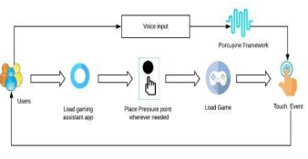
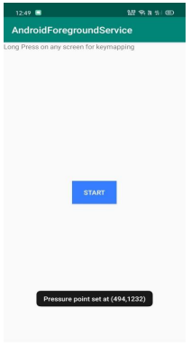
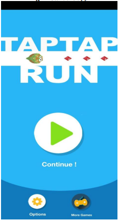
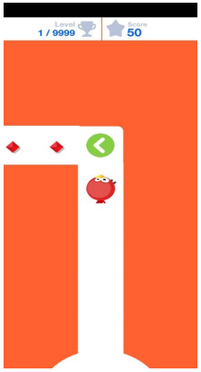
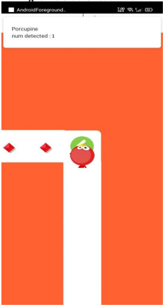
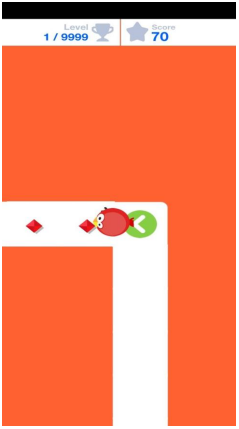
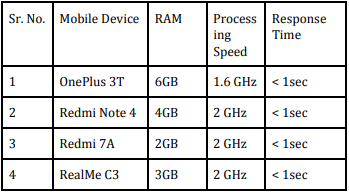

 

<h1 align="center">Gaming Assistant App for the Physically Disabled</h1>

     <h4 align="center">An Android application to enable specially abled people (missing a limb or both) to play android games, using only their voice.</h4>
      
     

-----------------------------------------
### Inspiration
Our project aims at allowing users to play android games using only their speech. We will be using speech-to-text technology to achieve this task. First, the user will place a ‘pressure point’ that is, a point on the screen whose coordinates are saved by the app. When the player speaks
the word ‘porcupine’, a touch event will be executed at the pressure points location thus, making the game deal as if someone is playing with their fingers.
Our aim is to help specially-abled players, get an equally immersive experience as that of normal players. Also, we plan to release this app on the Google Playstore in the coming future to allow anyone with an android device to play.

-----------------------------------------

### Implementation
* Built with Android and Porcupine Engine

### Results

* `System Architecture`

 

 

* `App Home Screen`

Before the app can begin executing touch events, a
pressure point needs to be placed anywhere on the
display

 

 

* `Game Screen`

This is the game where we put our app to the test

 

 

* `Before Touch Event and Trigger Word Detected`

Left image shows the screen where touch event is not yet detected and the right image shows that the trigger word said by the user is detected 

 
 &nbsp; &nbsp;
 

 

* `Touch Event Executed`

After the trigger word is successfully detected a touch event takes place and the character in the game makes a move

 

-----------------------------------------

### Testing

 

-------------------------------------------

### Dissemination

* Our paper based on this project was published in International Research Journal of Engineering and Technology (IRJET). View the paper [here](https://www.irjet.net/archives/V7/i8/IRJET-V7I8590.pdf)
