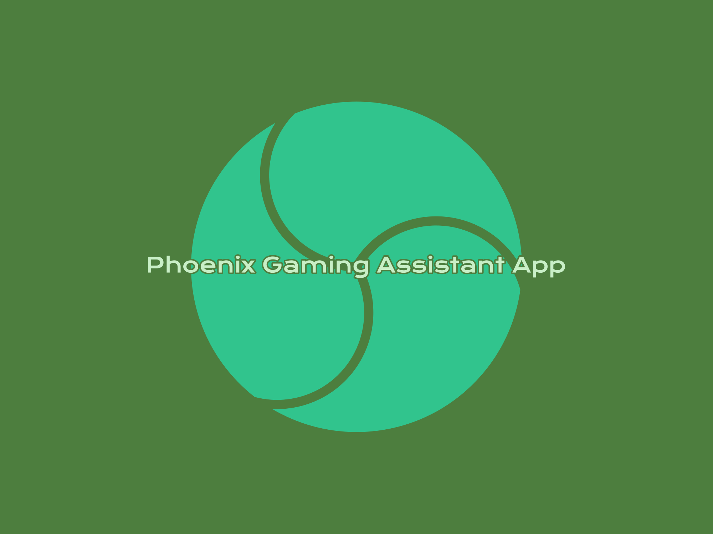

 

<h1 align="center">Gaming Assistant App for the Physically Disabled</h1>

     <h4 align="center">An Android application to enable specially abled people (missing a limb or both) to play android games, using only their voice.</h4>
      
     

-----------------------------------------
### Inspiration
The inspiration behind our project is to bridge the gap between gaming accessibility and specially-abled individuals. We believe that everyone should have the opportunity to enjoy the immersive experience of gaming, regardless of their physical abilities. By harnessing the power of speech-to-text technology, we're enabling users to control Android games using only their voice. Through our simple app, we're providing a seamless way for players to interact with the game, making it feel like a natural extension of themselves. Our ultimate goal is to make this technology widely accessible by releasing it on the Google Playstore, ensuring that anyone with an Android device can enjoy the thrill of gaming without limitations.

-----------------------------------------

### Implementation
* Built with Android and Porcupine Engine

* `System Architecture`

 

 

The three main aspects of the project are as follows:

* `Setting up Pressure Point` - The pressure point is a
coordinate which is mapped to a label ‘porcupine’. When
the label is said by the player, a touch event shall be
executed at the spot of the coordinate

* `Porcupine Framework` - This is a Speech-To-Text
framework for android developed by the company
PicoVoice. The framework constantly listens to the voice
input from the mobile device’s microphone. These voice
samples from the user are analyzed and using speech to
text recognition, and it is determined if the user said the
word ‘Porcupine’ or not.

* `Touch Event` - Once the user says the word
porcupine, a touch-event is executed at the location given
by the coordinates on the screen thus allowing the user to
play the game using only their voice.

### Results

* `App Home Screen`

Before the app can begin executing touch events, a
pressure point needs to be placed anywhere on the
display

 

 

* `Game Screen`

This is the game where we put our app to the test

 

 

* `Before Touch Event and Trigger Word Detected`

Left image shows the screen where touch event is not yet detected and the right image shows that the trigger word said by the user is detected 

 
 &nbsp; &nbsp;
 

 

* `Touch Event Executed`

After the trigger word is successfully detected a touch event takes place and the character in the game makes a move

 

-----------------------------------------

### Testing

 

-------------------------------------------

### Dissemination

* Our paper based on this project was published in International Research Journal of Engineering and Technology (IRJET). View the paper [here](https://www.irjet.net/archives/V7/i8/IRJET-V7I8590.pdf)
